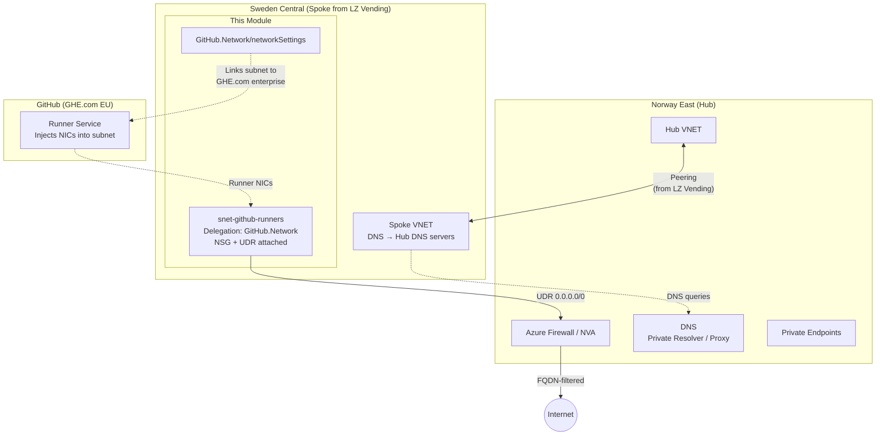
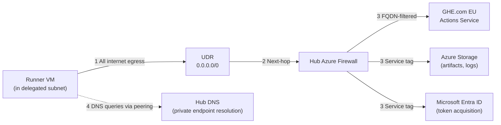

# GitHub-Hosted Runners VNET Integration for GHE.com (EU Data Residency)

Provisions the Azure networking resources needed to run GitHub-hosted runners inside your own VNET on GHE.com (GitHub Enterprise Cloud with EU data residency).

## Why this exists

GitHub-hosted runners normally run on GitHub's shared infrastructure and reach the internet directly. When your enterprise uses GHE.com with EU data residency, runners must connect through an Azure VNET so that traffic stays in-region and routes through your hub firewall. Setting this up by hand means creating a delegated subnet, an NSG, a route table, and the `GitHub.Network/networkSettings` ARM resource, then wiring them together correctly. This module does all of that in one `terraform apply`.

It layers on top of the [Azure Landing Zone Vending module](https://registry.terraform.io/modules/Azure/lz-vending/azurerm/latest). The vending module creates the subscription, resource group, spoke VNET, hub peering, and DNS. This module adds only what the vending module does not provide: the runner subnet, NSG, UDR for hub firewall egress, and the `GitHub.Network/networkSettings` resource that links the subnet to GHE.com.

Built with the [AzAPI provider](https://registry.terraform.io/providers/Azure/azapi/latest/docs) for direct ARM API access to the `GitHub.Network/networkSettings` resource type.

## Quick start

Minimum working configuration (assumes you already have a spoke VNET from LZ Vending):

```hcl
module "github_runners" {
  source = "github.com/martinopedal/ghec-vnet-runners-azure//terraform"

  resource_group_id       = "/subscriptions/SUBSCRIPTION_ID/resourceGroups/rg-ghrunners"
  virtual_network_id      = "/subscriptions/SUBSCRIPTION_ID/resourceGroups/rg-ghrunners/providers/Microsoft.Network/virtualNetworks/vnet-spoke"
  subnet_address_prefix   = "10.100.0.0/24"
  hub_firewall_private_ip = "10.0.1.4"
  github_business_id      = "12345678"  # your org/enterprise databaseId
}
```

```bash
# Register the resource provider (one-time)
az provider register --namespace GitHub.Network

# Deploy
terraform init && terraform apply
```

After `apply` completes, copy the `github_id` output and paste it into GHE.com under Enterprise Settings, Hosted compute networking, New network configuration.

## Table of Contents

- [Features](#features)
- [Architecture](#architecture)
  - [Architecture Diagram](#architecture-diagram)
  - [Traffic Flows](#traffic-flows)
- [What LZ Vending Creates vs. What This Module Creates](#what-lz-vending-creates-vs-what-this-module-creates)
- [Supported Regions (GHE.com EU)](#supported-regions-ghecom-eu)
- [Prerequisites](#prerequisites)
- [Usage](#usage)
  - [With LZ Vending Module](#with-lz-vending-module)
  - [Fetching the GitHub databaseId](#fetching-the-github-databaseid)
  - [Minimal Example](#minimal-example)
- [NSG Design](#nsg-design)
- [Hub Firewall Requirements](#hub-firewall-requirements)
  - [IP-Based Rules](#ip-based-rules)
  - [FQDN Rules](#fqdn-rules)
  - [EU-Specific Storage FQDNs](#eu-specific-storage-fqdns)
- [DNS](#dns)
- [TLS Interception](#tls-interception)
- [Subnet Constraints](#subnet-constraints)
- [RBAC](#rbac)
- [Module Reference](#module-reference)
  - [Requirements](#requirements)
  - [Resources](#resources)
  - [Inputs](#inputs)
  - [Outputs](#outputs)
- [Customer Documentation](#customer-documentation)
- [References](#references)
- [License](#license)

---

## Features

- Consumes LZ vending outputs directly (`resource_group_resource_ids`, `virtual_network_resource_ids`)
- Dedicated runner subnet delegated to `GitHub.Network/networkSettings`
- NSG with inbound deny-all (outbound policy handled by hub firewall via UDR)
- Route table with `0.0.0.0/0` next-hop to hub firewall
- `GitHub.Network/networkSettings` resource creation with `GitHubId` output
- Region validation against GHE.com EU supported regions
- Defaults to Sweden Central (most common choice for Nordic customers)

---

## Architecture

### Architecture Diagram



<details>
<summary>ASCII diagram (for terminals without Mermaid support)</summary>

```
+--------------------------------------+
|         Norway East (Hub)            |
|  +--------------------------------+  |
|  |  Hub VNET                      |  |
|  |  - Azure Firewall / NVA        |  |
|  |  - DNS (Priv. Resolver / Proxy)|  |
|  |  - Private Endpoints           |  |
|  +---------------+----------------+  |
+------------------+-------------------+
                   |  Peering (from LZ Vending)
+------------------+-------------------+
|  Sweden Central (Spoke from Vending) |
|  +---------------+----------------+  |
|  |  Spoke VNET (LZ Vending)       |  |
|  |  DNS -> Hub DNS servers        |  |
|  |  +---------------------------+ |  |
|  |  | snet-github-runners       | |  |
|  |  | <- This module            | |  |
|  |  | Delegation: GitHub.Network| |  |
|  |  | NSG + UDR attached        | |  |
|  |  +---------------------------+ |  |
|  +--------------------------------+  |
|  +--------------------------------+  |
|  | GitHub.Network/networkSettings |  |
|  | <- This module                 |  |
|  +--------------------------------+  |
+--------------------------------------+
```

</details>

### Traffic Flows



| # | Flow | Path | Notes |
|---|---|---|---|
| 1 | **Egress** | Runner > UDR > Hub Firewall > Internet | All outbound is FQDN-filtered by the hub firewall |
| 2 | **GitHub Actions** | Runner > Hub Firewall > GHE.com EU IPs | Runners register and pick up jobs from GHE.com |
| 3 | **Storage/Entra** | Runner > Hub Firewall > Service tags | Artifacts, logs, caches, and managed identity tokens |
| 4 | **DNS** | Runner > Hub DNS (via peering) | Resolves private endpoint FQDNs for Norway East resources |

---

> **AVNM (Azure Virtual Network Manager):** If the ALZ platform uses AVNM for hub-spoke connectivity instead of manual VNET peering, the spoke VNET from LZ Vending is connected to the hub through an AVNM network group. This module works the same way in both cases. It only needs the spoke VNET ID and the hub firewall IP. AVNM handles the peering lifecycle, route propagation, and security admin rules. Verify that the connectivity configuration allows the runner subnet to reach the hub firewall through the UDR.

## What LZ Vending Creates vs. What This Module Creates

| Resource | Created by | Notes |
|---|---|---|
| Subscription | LZ Vending | With `GitHub.Network` RP registered |
| Resource Group | LZ Vending | In Sweden Central (or other supported region) |
| Spoke VNET | LZ Vending | With DNS pointing to hub DNS infrastructure |
| VNET Peering to hub | LZ Vending | Bidirectional, with gateway transit if needed |
| **Runner Subnet** | **This module** | Delegated to `GitHub.Network/networkSettings` |
| **NSG** | **This module** | Inbound deny-all only |
| **Route Table** | **This module** | `0.0.0.0/0` to hub firewall |
| **GitHub.Network/networkSettings** | **This module** | Links subnet to GHE.com enterprise/org |

---

## Supported Regions (GHE.com EU)

| Runner Type | Supported Regions |
|---|---|
| x64 | `francecentral`, `swedencentral`, `germanywestcentral`, `northeurope` |
| arm64 | `francecentral`, `northeurope`, `germanywestcentral` |
| GPU | `italynorth`, `swedencentral` |

> **Note:** Norway East is **not** supported for GHE.com with EU data residency. Default is `swedencentral`. Override `location` if the vending module placed the VNET in a different supported region.

---

## Prerequisites

1. **LZ Vending module** has run and created the subscription, resource group, spoke VNET (in a supported EU region), and hub peering
2. `GitHub.Network` resource provider registered on the subscription:
   ```bash
   az provider register --namespace GitHub.Network
   ```
3. Azure RBAC: **Subscription Contributor** and **Network Contributor**
4. GitHub enterprise or organization `databaseId` (via GraphQL API or GitHub provider)
5. Hub DNS configured so the spoke VNET resolves private endpoint FQDNs
6. Hub firewall allows the required GitHub/GHE.com outbound traffic (see [Hub Firewall Requirements](#hub-firewall-requirements))
7. Hub firewall does **not** TLS-inspect traffic to GitHub/GHE.com endpoints

---

## Usage

### With LZ Vending Module

```hcl
module "lz_vending" {
  source  = "Azure/lz-vending/azurerm"
  version = "~> 4.0"

  location = "swedencentral"

  subscription_alias_enabled = true
  subscription_alias_name    = "sub-ghrunners-prod"
  subscription_display_name  = "GitHub Runners - Production"
  subscription_billing_scope = var.billing_scope
  subscription_workload      = "Production"

  resource_groups = {
    rg-runners = {
      name     = "rg-ghrunners-swedencentral"
      location = "swedencentral"
    }
  }

  virtual_networks = {
    vnet-runners = {
      name          = "vnet-ghrunners-swedencentral"
      address_space = ["10.100.0.0/16"]

      resource_group_creation_enabled = false
      resource_group_name             = "rg-ghrunners-swedencentral"

      hub_peering_enabled               = true
      hub_network_resource_id           = var.hub_vnet_id
      hub_peering_use_remote_gateways   = true
      hub_peering_allow_gateway_transit = true

      # Point spoke DNS at hub so runners resolve private endpoints
      dns_servers = ["10.0.1.4"]
    }
  }
}

module "github_runners" {
  source = "./terraform"

  resource_group_id       = module.lz_vending.resource_group_resource_ids["rg-runners"]
  virtual_network_id      = module.lz_vending.virtual_network_resource_ids["vnet-runners"]
  location                = "swedencentral"
  subnet_address_prefix   = "10.100.0.0/24"
  hub_firewall_private_ip = "10.0.1.4"
  github_business_id      = tostring(data.github_organization.this.id)

  tags = {
    environment = "production"
    team        = "platform-engineering"
  }
}
```

### Fetching the GitHub databaseId

```hcl
provider "github" {
  owner = "my-org"
  app_auth {
    id              = var.github_app_id
    installation_id = var.github_app_installation_id
    pem_file        = var.github_app_pem_file
  }
}

data "github_organization" "this" {
  name = "my-org"
}

# Pass to the module:
# github_business_id = tostring(data.github_organization.this.id)
```

### Minimal Example

```hcl
module "github_runners" {
  source = "./terraform"

  resource_group_id       = "/subscriptions/00000000-0000-0000-0000-000000000000/resourceGroups/rg-ghrunners"
  virtual_network_id      = "/subscriptions/00000000-0000-0000-0000-000000000000/resourceGroups/rg-ghrunners/providers/Microsoft.Network/virtualNetworks/vnet-spoke"
  subnet_address_prefix   = "10.100.0.0/24"
  hub_firewall_private_ip = "10.0.1.4"
  github_business_id      = "12345678"
}
```

---

## NSG Design

The NSG enforces **inbound isolation only**. All outbound policy is the hub firewall's responsibility. Internet-bound traffic from the runner subnet flows through Azure's default `AllowInternetOutBound` rule (priority 65001), hits the UDR, and is forwarded to the hub firewall. The firewall then applies the GitHub/GHE.com/Storage/Entra ID allowlists.

> **Why no outbound NSG rules?** Adding outbound IP rules to the NSG would be redundant with the firewall. Adding an explicit `DenyAllOutbound` would prevent traffic from reaching the hub firewall entirely, defeating the hub-spoke model.

| Priority | Name | Direction | Action | Purpose |
|---|---|---|---|---|
| 100 | DenyAllInbound | Inbound | Deny | GitHub never needs inbound access. Blocks Azure default AllowVNetInBound. |

---

## Hub Firewall Requirements

The hub firewall must allow the following outbound destinations for the runner subnet. All traffic is HTTPS (port 443/TCP). IP ranges are sourced from the [GHE.com network details](https://docs.github.com/en/enterprise-cloud@latest/admin/data-residency/network-details-for-ghecom).

### IP-Based Rules

| Rule | Destination | Port | Purpose |
|---|---|---|---|
| GitHub Actions (EU) | `74.241.192.231`, `20.4.161.108`, `74.241.204.117`, `20.31.193.160` | 443 | Runner to Actions service |
| GHE.com EU infra | `108.143.197.176/28`, `20.123.213.96/28`, `20.224.46.144/28`, `20.240.194.240/28`, `20.240.220.192/28`, `20.240.211.208/28` | 443 | Runner to GHE.com |
| GitHub.com | `192.30.252.0/22`, `185.199.108.0/22`, `140.82.112.0/20`, `143.55.64.0/20` + 15 /32s (see `locals.tf`) | 443 | Required for all regions |
| Azure Storage | `Storage` service tag or EU-specific FQDNs | 443 | Artifacts, logs, caches |
| Microsoft Entra ID | `AzureActiveDirectory` service tag | 443 | Managed identity token acquisition |
| Azure Monitor | `AzureMonitor` service tag | 443 | Optional diagnostics |

### FQDN Rules

| Domain | Why needed |
|--------|------------|
| `*.[TENANT].ghe.com` | GHE.com enterprise API, Git, packages. All enterprise services route through this |
| `[TENANT].ghe.com` | GHE.com enterprise web portal |
| `auth.ghe.com` | GHE.com authentication service |
| `github.com` | GitHub platform services. Required for all GHE.com regions per GitHub docs |
| `*.githubusercontent.com` | Runner version updates, raw content, release assets |
| `*.blob.core.windows.net` | Azure Blob Storage. Used for job summaries, logs, artifacts, caches |
| `*.web.core.windows.net` | Azure Web Storage. Used by GitHub for web-based content |
| `*.githubassets.com` | GitHub static assets (JS, CSS, images) |
| `login.microsoftonline.com` | Primary Entra ID endpoint. Managed identity token acquisition |
| `*.login.microsoftonline.com` | Regional Entra ID endpoints |
| `*.login.microsoft.com` | Entra ID fallback. Some Azure SDKs use this domain |
| `management.azure.com` | Azure Resource Manager. Needed if runners access Azure resources |
| `*.identity.azure.net` | IMDS managed identity token endpoint. Runner VMs request tokens on startup |

### EU-Specific Storage FQDNs

Tighter alternative to `*.blob.core.windows.net` for a more restrictive firewall posture:

| FQDN |
|---|
| `prodsdc01resultssa0.blob.core.windows.net` |
| `prodsdc01resultssa1.blob.core.windows.net` |
| `prodsdc01resultssa2.blob.core.windows.net` |
| `prodsdc01resultssa3.blob.core.windows.net` |
| `prodweu01resultssa0.blob.core.windows.net` |
| `prodweu01resultssa1.blob.core.windows.net` |
| `prodweu01resultssa2.blob.core.windows.net` |
| `prodweu01resultssa3.blob.core.windows.net` |

### Optional Azure Monitor FQDNs (if diagnostics enabled)

| Domain | Why needed |
|--------|------------|
| `*.ods.opinsights.azure.com` | Log Analytics data ingestion (if using diagnostics) |
| `*.oms.opinsights.azure.com` | Log Analytics operations (if using diagnostics) |
| `*.ingest.monitor.azure.com` | Data Collection Endpoint (if using diagnostics) |
| `*.monitor.azure.com` | Azure Monitor control plane (if using diagnostics) |

### Copy-Pasteable Azure Firewall Rule Collection

Replace `<runner-subnet-cidr>` with the runner subnet CIDR and `[TENANT]` with your GHE.com subdomain.

```text
Rule Collection: rc-ghec-runners-application
Priority: 200
Action: Allow

Rules:
  - Name: ghecom-runners
    Source: <runner-subnet-cidr>
    FQDNs: [TENANT].ghe.com, *.[TENANT].ghe.com,
           *.actions.[TENANT].ghe.com, auth.ghe.com,
           github.com, *.githubassets.com,
           *.githubusercontent.com,
           *.blob.core.windows.net, *.web.core.windows.net
    Protocol: Https:443

  - Name: azure-platform
    Source: <runner-subnet-cidr>
    FQDNs: login.microsoftonline.com, *.login.microsoftonline.com,
           *.login.microsoft.com, management.azure.com,
           *.identity.azure.net
    Protocol: Https:443

  - Name: azure-monitor (optional - if diagnostics enabled)
    Source: <runner-subnet-cidr>
    FQDNs: *.ods.opinsights.azure.com, *.oms.opinsights.azure.com,
           *.ingest.monitor.azure.com, *.monitor.azure.com
    Protocol: Https:443
```

```text
Rule Collection: rc-ghec-runners-network
Priority: 200
Action: Allow

Rules:
  - Name: azure-services
    Source: <runner-subnet-cidr>
    Service Tags: Storage, AzureActiveDirectory, AzureMonitor
    Protocol: TCP
    Port: 443
```

---

## DNS

The LZ vending module configures `dns_servers` on the spoke VNET, forwarding all DNS queries to the hub. This is required when runners need to resolve private endpoint FQDNs for resources in Norway East.

| Hub DNS Type | What to set as `dns_servers` in LZ Vending |
|---|---|
| Azure Firewall DNS Proxy | Firewall private IP |
| Azure DNS Private Resolver | Inbound endpoint IP |
| Custom DNS VMs | Forwarder VM IPs |

---

## TLS Interception

Outbound traffic from the runner subnet **must not** be subject to TLS inspection. GitHub runner VMs do not trust intermediate certificates. Exclude GitHub and GHE.com traffic from TLS inspection policy on the hub firewall, or use custom runner images with pre-installed certificates.

---

## Subnet Constraints

| Property | Value |
|---|---|
| Delegation | `GitHub.Network/networkSettings` |
| State at creation | Must be empty (no existing NICs) |
| Minimum size | /24 (251 usable IPs) |
| Sizing guidance | Max concurrent runners + 30% buffer |
| Service association link | Applied automatically, prevents accidental deletion |
| Shared use | Cannot host other Azure services |

---

## RBAC

| Requirement | Details |
|---|---|
| Subscription Contributor | Register `GitHub.Network` resource provider |
| Network Contributor | Delegate subnet, manage network resources |
| Enterprise App: GitHub CPS Network Service | `85c49807-809d-4249-86e7-192762525474` (auto-created) |
| Enterprise App: GitHub Actions API | `4435c199-c3da-46b9-a61d-76de3f2c9f82` (auto-created) |

---

## Module Reference

### Requirements

| Name | Version |
|---|---|
| terraform | >= 1.9 |
| azapi | ~> 2.0 |

### Resources

| Name | Type | API Version |
|---|---|---|
| [azapi_resource.subnet](https://registry.terraform.io/providers/Azure/azapi/latest/docs/resources/resource) | resource | Microsoft.Network/virtualNetworks/subnets@2024-05-01 |
| [azapi_resource.nsg](https://registry.terraform.io/providers/Azure/azapi/latest/docs/resources/resource) | resource | Microsoft.Network/networkSecurityGroups@2024-05-01 |
| [azapi_resource.route_table](https://registry.terraform.io/providers/Azure/azapi/latest/docs/resources/resource) | resource | Microsoft.Network/routeTables@2024-05-01 |
| [azapi_resource.network_settings](https://registry.terraform.io/providers/Azure/azapi/latest/docs/resources/resource) | resource | GitHub.Network/networkSettings@2024-04-02 |

### Inputs

#### Required

| Name | Description | Type |
|---|---|---|
| `resource_group_id` | Full resource ID of the resource group created by LZ vending. | `string` |
| `virtual_network_id` | Full resource ID of the spoke VNET created by LZ vending. Must be in a supported GHE.com EU region. | `string` |
| `subnet_address_prefix` | CIDR for the runner subnet. /24 minimum recommended (max concurrency + 30% buffer). | `string` |
| `hub_firewall_private_ip` | Private IP of the hub firewall or NVA. Used as next-hop in the default route. | `string` |
| `github_business_id` | GitHub enterprise or organization databaseId. Obtain via GraphQL API or the GitHub Terraform provider. | `string` |

#### Optional

| Name | Description | Type | Default |
|---|---|---|---|
| `location` | Azure region. Must match the VNET region and be a supported GHE.com EU region. | `string` | `"swedencentral"` |
| `subnet_name` | Name of the dedicated GitHub runner subnet. | `string` | `"snet-github-runners"` |
| `nsg_name` | Name of the Network Security Group for the runner subnet. | `string` | `"nsg-github-runners"` |
| `route_table_name` | Name of the route table for the runner subnet. | `string` | `"rt-github-runners"` |
| `network_settings_name` | Name of the GitHub.Network/networkSettings resource. | `string` | `"ghrunners-network-settings"` |
| `tags` | Tags applied to all resources created by this module. | `map(string)` | `{}` |

### Outputs

| Name | Description |
|---|---|
| `subnet_id` | Resource ID of the delegated runner subnet. |
| `nsg_id` | Resource ID of the Network Security Group. |
| `route_table_id` | Resource ID of the route table. |
| `network_settings_id` | Resource ID of the GitHub.Network/networkSettings resource. |
| `github_id` | GitHubId from the networkSettings resource. Paste this into the GHE.com network configuration UI under Enterprise Settings > Hosted compute networking > New network configuration. |

---

## Customer Documentation

Detailed infrastructure requirements, IP lists, firewall rules, and DNS options are documented in customer-ready format:

- [English](docs/customer-ready-en.md)
- [Norwegian](docs/customer-ready-no.md)

---

## References

- [GHE.com Network Details](https://docs.github.com/en/enterprise-cloud@latest/admin/data-residency/network-details-for-ghecom)
- [Configuring Private Networking (Enterprise)](https://docs.github.com/en/enterprise-cloud@latest/admin/configuring-settings/configuring-private-networking-for-hosted-compute-products/configuring-private-networking-for-github-hosted-runners-in-your-enterprise)
- [About Azure Private Networking for Runners](https://docs.github.com/en/enterprise-cloud@latest/admin/configuring-settings/configuring-private-networking-for-hosted-compute-products/about-azure-private-networking-for-github-hosted-runners-in-your-enterprise)
- [Troubleshooting Private Networking](https://docs.github.com/en/enterprise-cloud@latest/admin/configuring-settings/configuring-private-networking-for-hosted-compute-products/troubleshooting-azure-private-network-configurations-for-github-hosted-runners-in-your-enterprise)
- [GitHub.Network/networkSettings ARM Schema](https://learn.microsoft.com/azure/templates/github.network/2024-04-02/networksettings)
- [Azure Subnet Delegation](https://learn.microsoft.com/azure/virtual-network/subnet-delegation-overview)
- [Azure DNS Private Resolver](https://learn.microsoft.com/azure/dns/dns-private-resolver-overview)
- [Hub-Spoke Network Topology](https://learn.microsoft.com/azure/architecture/networking/architecture/hub-spoke)
- [LZ Vending Module](https://registry.terraform.io/modules/Azure/lz-vending/azurerm/latest)
- [AzAPI Provider](https://registry.terraform.io/providers/Azure/azapi/latest/docs)
- [AzAPI Schema Issue for GitHub.Network](https://github.com/Azure/terraform-provider-azapi/issues/447)

---

## License

MIT
